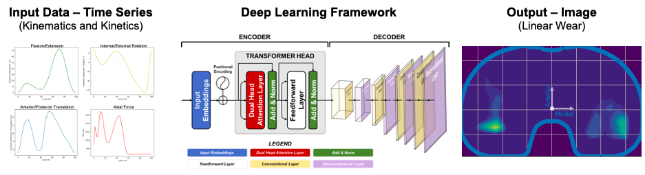

# Gait-to-Contact (G2C)

This project aims to predict wear scars in total knee replacements (TKRs) settings using a transformer-CNN based encoder-decoder architecture. The methodology combines gait parameters as inputs and processes them to generate heatmaps representing wear scars, which are compared against ground truth using various metrics (MAPE, SSIM, NMI).


<br>

<p align="center">
  
</p>

<br>


## Data
Input data are consists on multivariate time series including:
* ```anterior/posterior translation``` of the knee implant during gait 
* ```internal/external rotation``` of the knee implant during gait
* ```flexion/extension rotation``` of the knee implant during gait
* ```axial loading``` within the knee implant during gait <br>

These data are not included in the repo and available on request

## Repository Structure
* ```main.ipynb:``` Jupyter Notebook for running the pipeline
* ```functions/:``` Contains modular Python functions organized as:
    * ```utilities.py:``` general utility functions
    * ```data_processing.py:``` functions for data preprocessing, handling and preparation
    * ```model.py:``` model definition and architecture setup
    * ```train_validate.py:``` includes training and validation functions for the model
    * ```evaluate.py:``` metrics and evaluation functions
    * ```metrics.py:``` functions to for specific metrics calculation like SSIM, NMI and MAPE
    * ```hp_tuning.py:``` hyperparameter tuning utilities
    * ```interpolate.py:``` functions to export data from Abaqus 
* ```docs/```
    * ```abstract ISTA 2024:``` abstract accepted at ISTA 2024 and presented as a podium presentation
    * ```paper medRxiv:``` preprint version of the research paper currently under review
* ```figures/```
    * ```pipeline:``` figure showcasing the end-to-end workflow of the project
* ```requirements.txt:``` list of all necessary dependencies for running the project


## Key Steps in the Pipeline
* ```Preprocessing:``` Processes raw gait parameters and saves them to an output folder
* ```Model Training:``` Trains a continuous model for wear scar prediction, saving the best model in ONNX format
* ```Evaluation:``` Computes evaluation metrics and visualizes predictions against ground truth


  

## References
This work is a preprint and is currently undergoing peer review. Please cite the MedRxiv version as follows:

```
@article{perrone2024g2c,
  title={Gait-to-Contact (G2C) - A novel deep learning framework to predict total knee replacement wear from gait patterns},
  author={Perrone M. et al.},
  journal={MedRxiv},
  year={2024}
}
```
